来自 C4 安全团队的二开手记，学着自己也优化一下

## 灯塔安装

初始账号密码

```
admin/arlpass
```

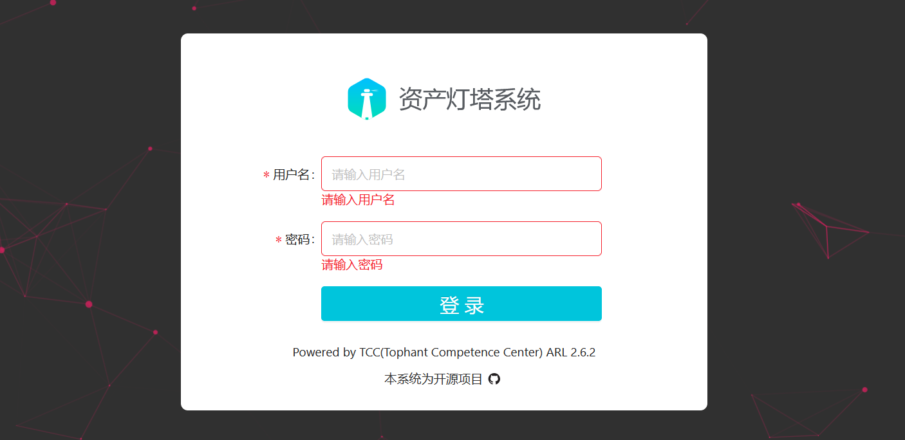

**下载**

选择灯塔魔改版下载，ARL-Puls 是基于灯塔ARL修改后的版本。相比原版，增加了OneForAll、中央[数据库](https://so.csdn.net/so/search?q=数据库&spm=1001.2101.3001.7020)，修改了altDns。

Github地址：https://github.com/ki9mu/ARL-plus-docker

下载上传或克隆

```
git clone https://github.com/ki9mu/ARL-plus-docker
```


**修改配置文件**

修改域名禁止项

灯塔中指定了无法扫描域名后缀 .edu .gov .org，开启 Docker 之前修改为不存在域名

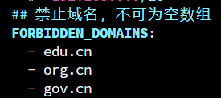

修改后

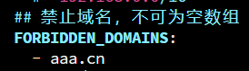

配置 Fofa API

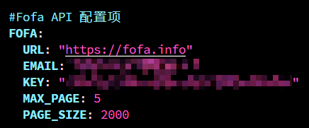


**启动**

先添加 Docker 数据卷

```
docker volume create --name=arl_db
```

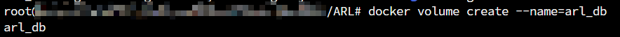

```
docker-compose up -d
```

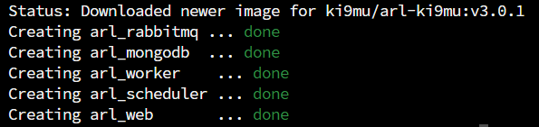


# 优化增强

## 子域名字典扩容

灯塔自带的字典仅包含两万个子域名，依赖这个字典进行扫描往往会漏掉一些潜在的子域名

将准备好的子域名字典复制到 arl_worker 中，使⽤如下命令：

```
docker cp domain_2w.txt ID:/code/app/dicts/domain_2w.txt
systemctl restart docker
```

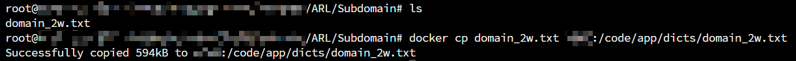


## 指纹增强

添加指纹，让灯塔拥有更强大的指纹，参考使用 ARL-Finger-ADD

```
git clone https://github.com/loecho-sec/ARL-Finger-ADD
```

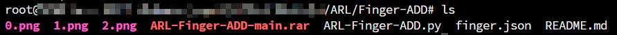

脚本主要实现的功能是通过读取 finger.json 中的数据，向灯塔系统批量添加指纹信息	

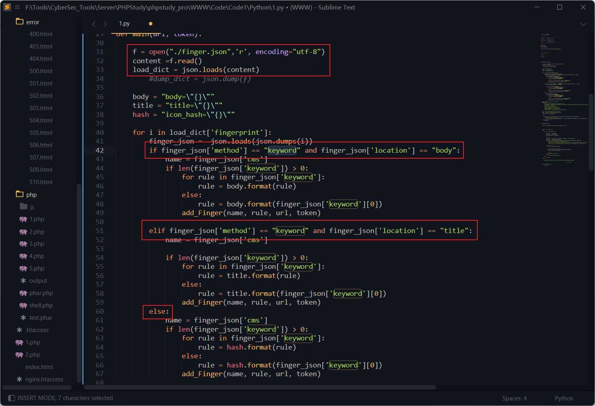

"keyword"代表关键词识别，通过检索网站 HTML 的 body 或 title 中关键词来识别网站所使用的 CMS；
"faviconhash"代表哈希识别，通过对比网站的 favicon 图标哈希值来识别网站使用的 CMS。

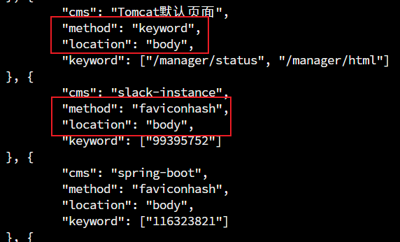

当收集到更多指纹字典时，可以参考 finger.json 的格式来批量导入指纹

```
python3 ARl-Finger-ADD.py https://192.168.1.1:5003/ admin password
```

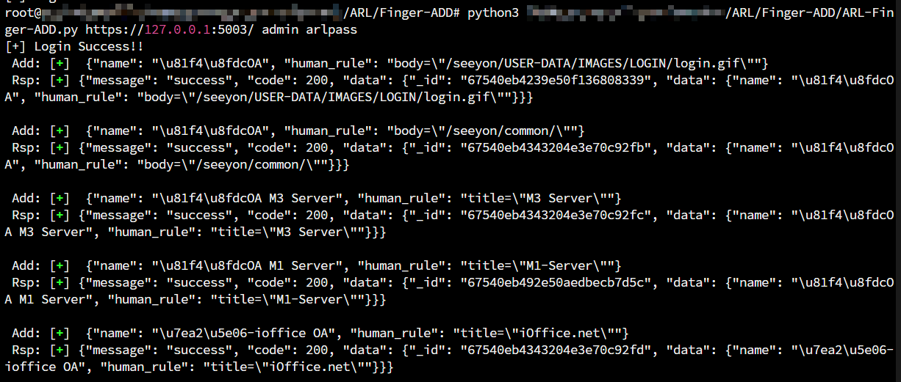


## 文件泄露检测功能优化

源代码在 /code/app/servers/fileLeak.py

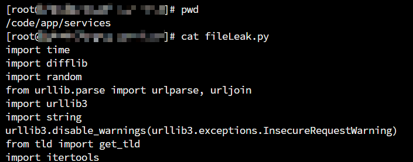

增加扫描的线程数

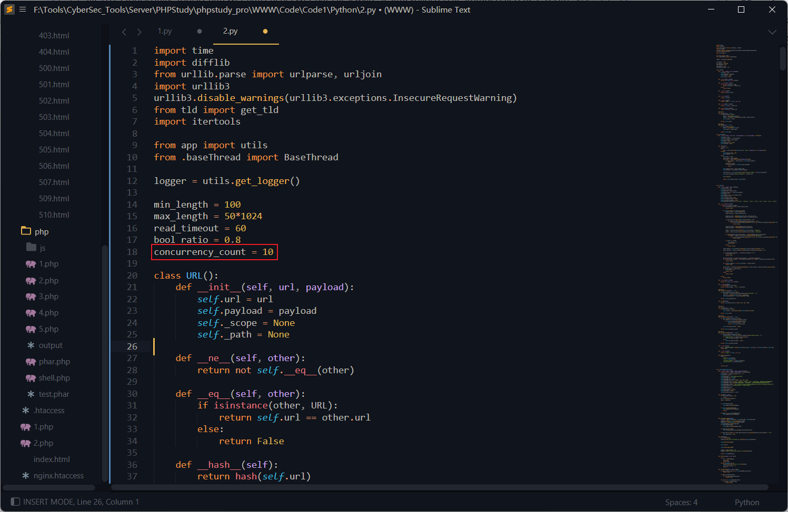

当域名较多时候会出现任务卡死的BUG，增加 try-except 错误处理机制，当检测超时时则返回状态码 404，防⽌服务器响应时间过长导致的长时间堵塞

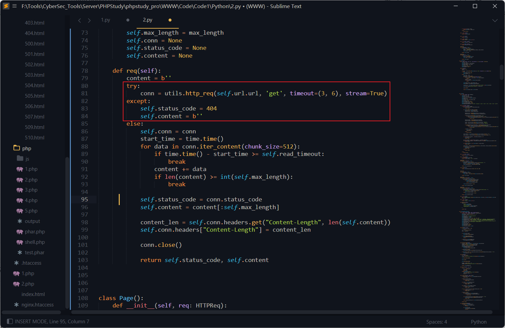


## 漏扫轻量化

Nuclei 的核心逻辑是通过大量的 POC 模板 进行扫描，这种操作可能会对目标系统造成比较大的负面影响。

通过增加轻型扫描工具，让灯塔系统更加完整，这里采用 Vscan 二开版本，选择合适的版本下载并上传至 Linux 服务器

```
https://github.com/youki992/VscanPlus
```

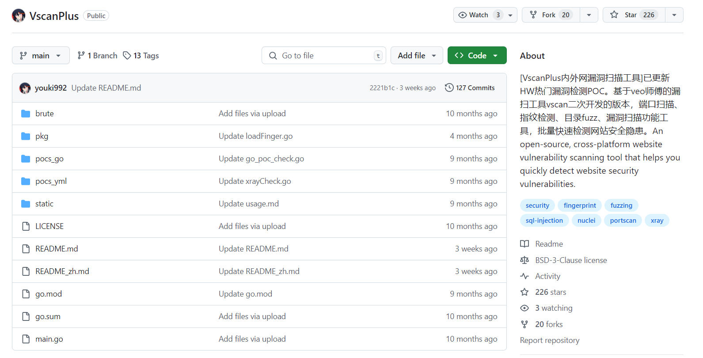

nuclei 相关代码在 /code/app/servers/nuclei_scan.py，逐步修改源码

添加 VscanPlus 的结果保存地址

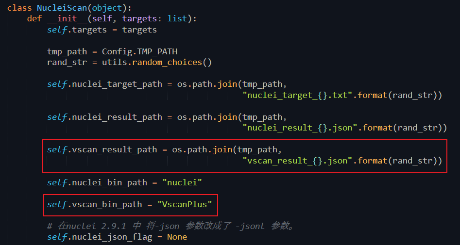

在将 Nuclei 扫描替换为 VscanPlus 扫描时，VscanPlus 的 JSON 结果中包含以下关键字段：

"POC"：对应扫描中使用的漏洞验证命令（POC）。

"file-fuzz"：记录扫描过程中检测到的文件路径或目录地址。

"technologies"：表示扫描过程中识别到的指纹信息（如CMS、服务器类型等）。

其余字段与 Nuclei 输出相同，无需修改。通过调整扫描执行和结果处理逻辑，可以无缝集成 Vscan 扫描。

修改读写逻辑

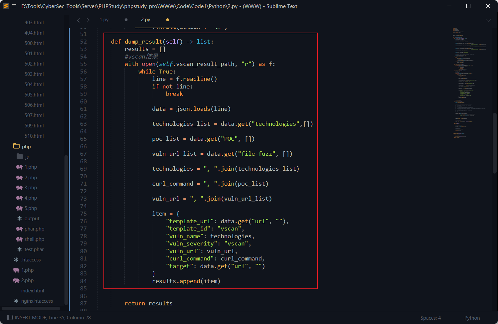

修改运行命令

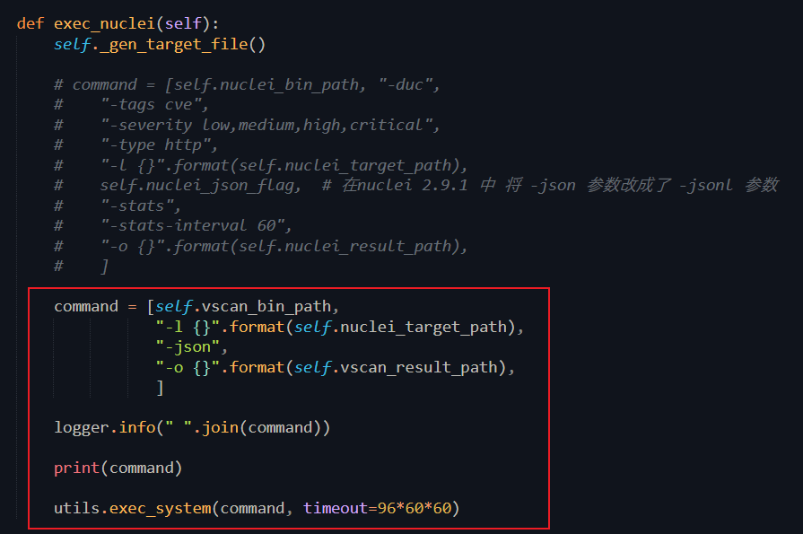

ARL的 docker 中没有安装 libpcap 包，需要安装并添加软链接

```
yum install libpcap
ln -s /usr/lib64/libpcap.so.1.5.3 /usr/lib64/libpcap.so.0.8
```

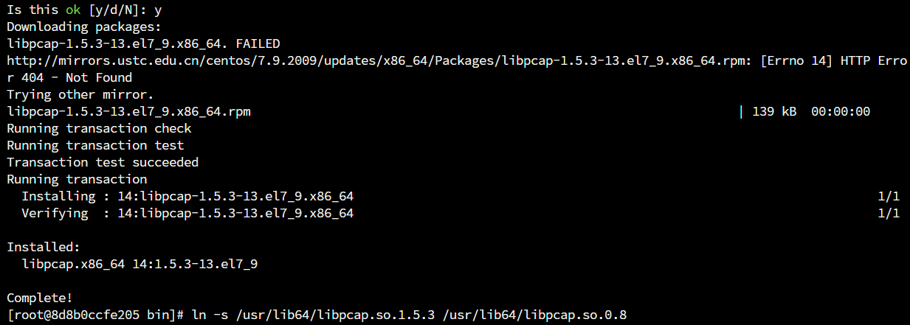

测试，运行成功

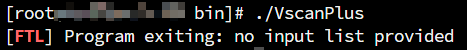

最后在 ARL 中测试运行正常

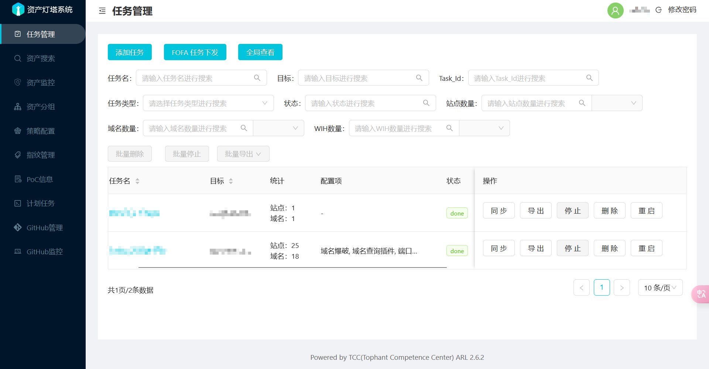


# 后话

ARL灯塔在日常的信息收集中用的比较勤，结合 Ez、dddd 等工具使用，比较顺手，有机会也想自己学习着开发一款漏扫工具的说 A.A
